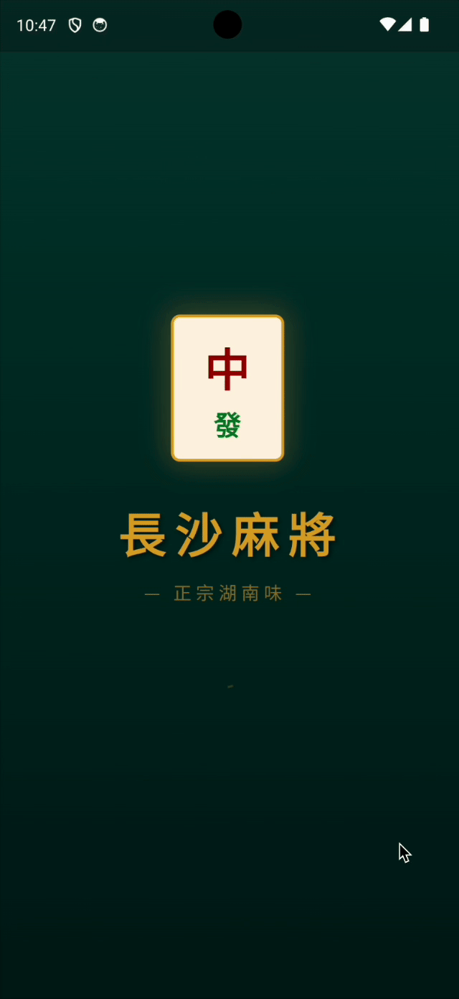
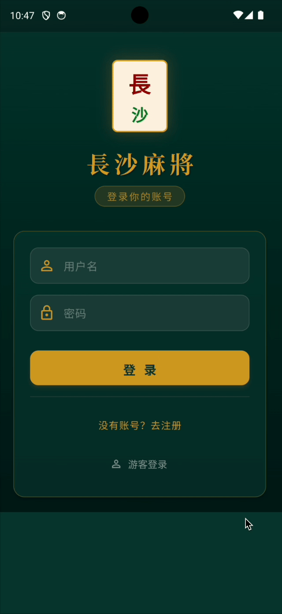
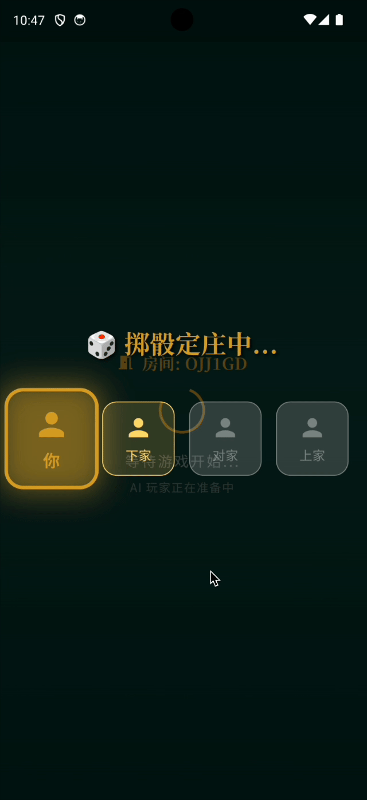
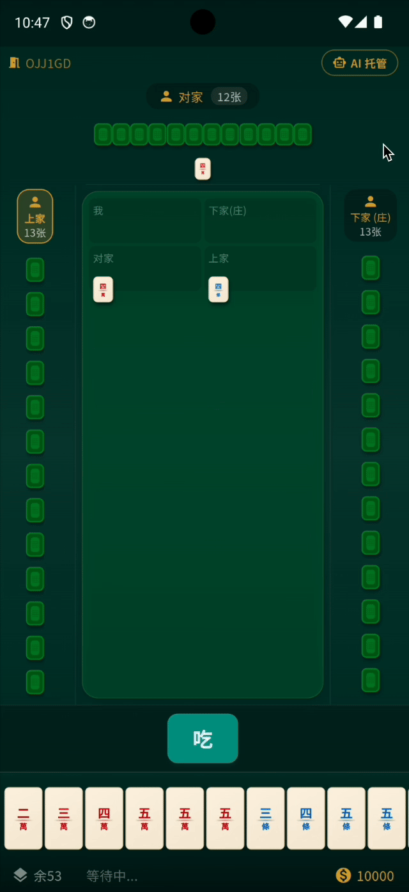
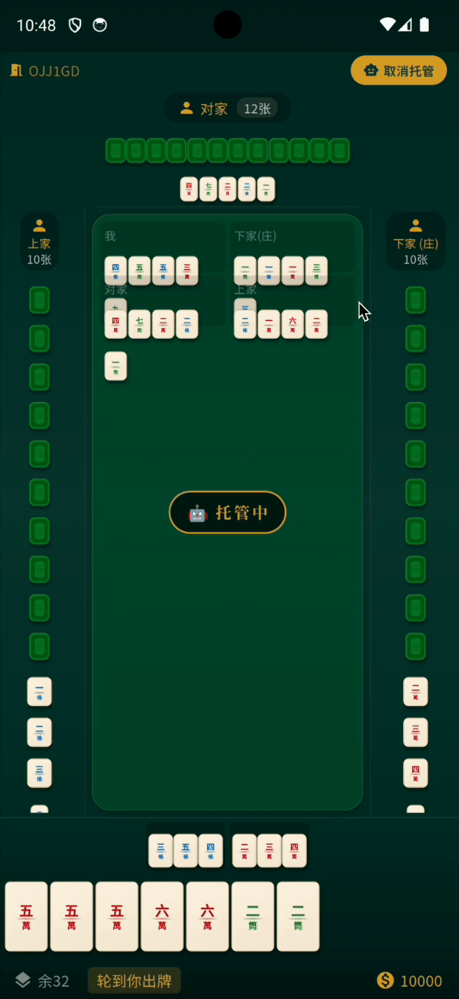
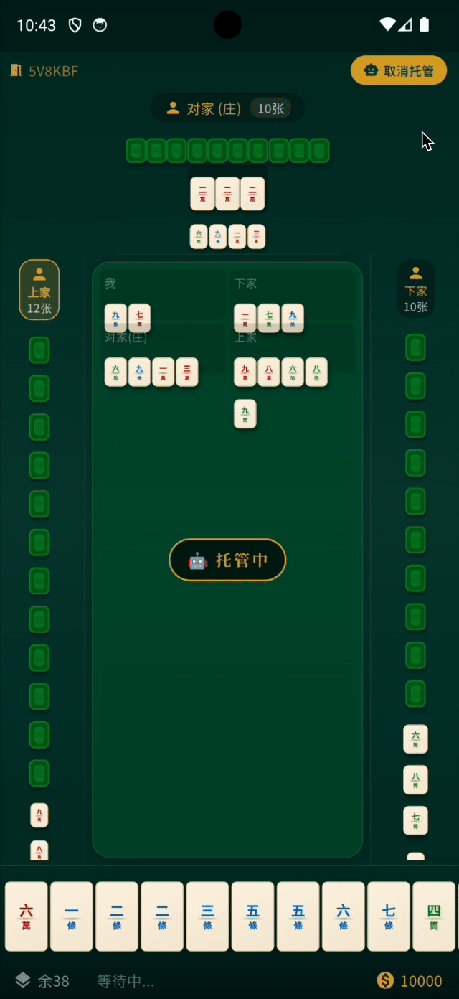
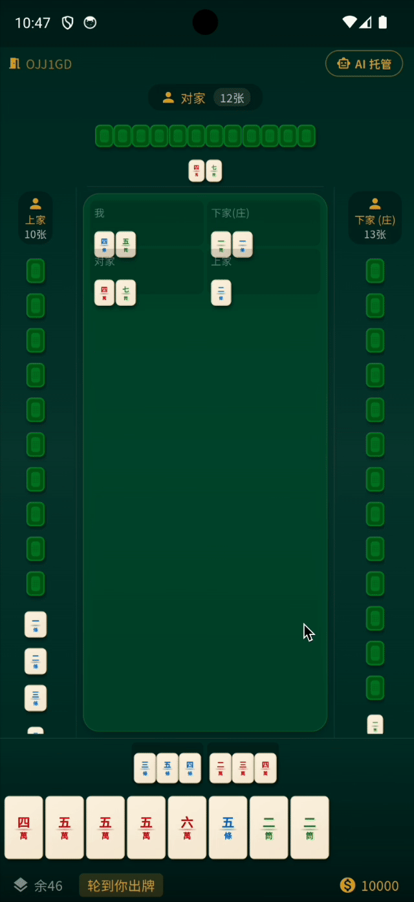

# 长沙麻将网络版 — v2.0

<p align="center">
  
</p>

<p align="center">
  <code>v2.0.0</code>
  · <code>Flutter 3.27</code>
  · <code>Node 20</code>
  · <code>TypeScript 5</code>
  · <code>Android 14</code>
  · <code>Docker</code>
  · <code>MIT</code>
</p>

基于 **Flutter + Node.js (Express)** 构建的多人在线长沙麻将手机游戏，支持实时联机对战与 AI 对战。2.0 版本在 UI/UX、游戏规则、AI 系统和视觉特效方面进行了全面升级。

## 技术栈

| 层级 | 技术 |
|------|------|
| 客户端 | Flutter 3.27 (Dart) · Material 3 · Android |
| 服务端 | Node.js · Express · TypeScript · Socket.io |
| 数据库 | MySQL 8.0 · Redis 7 |
| 部署 | Docker Compose · GitHub |

---

## 版本 2.0 核心更新（2026-05-21）

### 🎨 UI/UX 全面升级
- **中式麻将主题**：青绿渐变背景、金色点缀、米白牌面配色方案
- **Material 3 设计语言**：卡片化界面、圆角组件、动态色彩
- **启动页动画**：旋转的中发 logo + 缩放淡入
- **登录页**：金色边框卡片、图标输入框、毛玻璃效果
- **大厅页**：三种模式卡片化（快速匹配 / 好友房 / AI 练习）
- **3D 麻将牌组件**：渐变牌面、中文数字标识、花色配色
- **Google Fonts**：思源宋体（标题）+ 思源黑体（正文）

<p align="center">
  
  
</p>
<p align="center"><em>开屏动画 · 游客登录</em></p>

### 🀄 长沙麻将规则完整实现

| 功能 | 说明 |
|------|------|
| 定庄 | 掷两颗骰子，逆时针数点定庄，附带座位轮转动画 |
| 发牌 | 庄家 14 张，闲家 13 张 |
| 碰杠吃胡 | 完整碰、明杠/暗杠/补杠、吃牌、自摸/点炮 |
| 胡牌牌型 | 七小对、碰碰胡、将将胡、清一色、基本胡 |
| 起手胡 | 四喜、板板胡、缺一色、六六顺 |
| 扎鸟 | 胡牌后翻 2 张墙牌，中鸟番数翻倍，含翻牌动画 |
| 流局 | 牌墙摸完自动结算，无鸟牌 |
| 海底捞月 | 墙牌只剩一张时摸牌胡牌 |
| 再来一局 | 自动重新加入 AI 对局 |

<p align="center">
  
  
  
  
</p>
<p align="center"><em>定庄摇号 · 吃牌 · 碰牌 · 杠牌</em></p>

### 🤖 AI 系统
- **三个 AI 对手**：自动加入对局、智能决策
- **AI 出牌算法**：基于牌价值评估的选牌策略
- **AI 动作决策**：吃/碰/杠/胡自动选择（带随机扰动）
- **托管模式**：玩家可开启自动托管，AI 代打

<p align="center">
  
</p>
<p align="center"><em>AI 托管演示</em></p>

### ✨ 动画与特效
- **定庄摇号**：四个座位循环高亮，减速定格庄家
- **胡牌特效**：弹性缩放 + 金色大字 + 阴影淡出
- **扎鸟翻牌**：牌面翻转动画（背面向正面翻转）
- **结算动画**：渐进式展示鸟牌、分数、比赛结果

---

## 长沙麻将规则

### 基础
- 108 张牌：万、条、筒各 1-9，每种 4 张
- 小胡：2 / 5 / 8 做将

### 特殊胡型
- 天胡 / 地胡 / 碰碰胡 / 将将胡
- 清一色 / 七小对 / 全求人 / 海底捞月 / 杠上开花

### 起手胡
- 四喜 / 板板胡 / 缺一色 / 六六顺

### 扎鸟
- 胡牌后翻 2 张鸟牌，命中则番数翻倍

---

## 项目结构

```
changsha-mahjong/
├── client/                  # Flutter 客户端
│   └── lib/
│       ├── config/          # 主题、路由、常量
│       ├── pages/           # 页面组件
│       │   ├── splash/      # 启动页（动画）
│       │   ├── login/       # 登录/注册
│       │   ├── lobby/       # 大厅（模式选择）
│       │   ├── room/        # 好友房等待
│       │   ├── game/        # 游戏主页面
│       │   └── result/      # 结算页面
│       ├── services/        # 音频、Socket 服务
│       └── widgets/         # 麻将牌 UI 组件
├── server/                  # Node.js 服务端
│   └── src/
│       ├── modules/
│       │   ├── game/        # 游戏引擎
│       │   │   ├── engine.ts             # 核心引擎
│       │   │   ├── turn-manager.ts       # 回合管理
│       │   │   ├── tile-manager.ts       # 牌墙管理
│       │   │   ├── win-detector.ts       # 胡牌检测
│       │   │   ├── score-calculator.ts   # 分数计算
│       │   │   ├── action-validator.ts   # 动作验证
│       │   │   ├── ai-player.ts          # AI 决策
│       │   │   └── replay-recorder.ts    # 回放记录
│       │   ├── auth/        # 注册/登录/JWT
│       │   ├── room/        # 房间创建与管理
│       │   └── friend/      # 好友系统
│       ├── models/          # TypeORM 实体
│       └── middleware/      # JWT 认证中间件
├── shared/                  # 前后端共享常量与协议定义
└── docker-compose.yml       # 一键启动（MySQL + Redis + Server）
```

---

## 快速开始

### 方式一：Docker Compose（推荐）

```bash
docker compose up -d
```

服务启动后监听 `3000` 端口，数据库和缓存均自动就绪。

### 方式二：本地开发

#### 服务端

```bash
cd server
npm install
cp .env.example .env  # 填写 MySQL / Redis 连接信息
npm run dev
```

#### 客户端

```bash
cd client
flutter pub get
flutter build apk --debug --dart-define=SERVER_URL=http://10.0.2.2:3000
adb install -r build/app/outputs/flutter-apk/app-debug.apk
```

### Android 模拟器连接

| 配置 | 值 |
|------|-----|
| AVD | Pixel_6 (arm64-v8a) |
| API | android-34 |
| 服务端地址 | `http://10.0.2.2:3000` |
| 调试工具 | scrcpy 窗口镜像 |

---

## 通信协议

采用 **socket.io** 实现实时双向通信：

| 方向 | 事件 | 说明 |
|------|------|------|
| → 客户端 | `game:dice` | 掷骰子信息 |
| → 客户端 | `game:start` | 游戏开始，包含手牌 |
| → 客户端 | `game:turn` | 当前出牌玩家 |
| → 客户端 | `game:tile_drawn` | 摸牌 |
| → 客户端 | `game:tile_discarded` | 出牌 |
| → 客户端 | `game:action_prompt` | 动作提示 |
| → 客户端 | `game:action_result` | 动作结果 |
| → 客户端 | `game:bird_reveal` | 扎鸟翻牌 |
| → 客户端 | `game:result` | 结算结果 |
| 客户端 → | `game:action` | 玩家操作 |

---

## Bug 修复记录（v2.0）

| Bug | 问题 | 修复 |
|-----|------|------|
| Docker 网络断连 | server 容器未绑定 bridge 网络 | 重建容器，挂载 `changsha-mahjong-master_default` |
| 结算页崩溃 | `_playerName` 数组 `['下家','对家','上家']` 索引越界 | 改用 4 元素数组 + `(seat - mySeatIndex + 4) % 4` |
| 流局崩溃 | `cast<int>()` 遇到 double 类型 | 改用 `(e as num).toInt()` |
| 吃牌无反应 | 客户端读 `tileIds`，服务端发 `tiles` | 对齐数据格式 |
| AI 出牌卡死 | 计时器竞态条件 | 增强 phase/seat 校验，避免过期 timer 触发 |
| AI 房间进不去 | `room:joinAI` 无 `roomType` | 大厅直接跳转 `/game` |
| 再来一局转圈 | 跳到已销毁的 `/room` | 先 `room:leave` 再 `room:joinAI` |

---

## 🌐 局域网对战（P2P 直连）

无需中央服务器，同一 WiFi 下的设备直接对战的局域网模式。

### 使用条件
- 所有设备连接 **同一个 WiFi**
- 不需要 Docker 服务端，不需要联网

### 操作步骤

**🎯 房主（创建房间）**
1. 在大厅点击 **「局域网对战」**
2. 切换到 **「创建房间」** 标签
3. 输入房间名称（默认 `xxx的房间`）
4. 点击 **创建房间** → 自动启动局域网游戏服务器
5. 页面显示本机 IP 地址和端口号（如 `192.168.x.x:9876`），告知其他玩家
6. 等待玩家加入，列表实时更新
7. 点击 **「开始游戏」** 开战（空位由 AI 自动补位）

**🔍 玩家（加入房间）**
1. 在大厅点击 **「局域网对战」**
2. 切换到 **「加入房间」** 标签
3. **自动发现**：同一 WiFi 下的房间自动列出，点击即可加入
4. **手动输入**：也可手动输入房主的 IP 和端口进行连接

### 技术原理

| 技术 | 用途 |
|------|------|
| **mDNS 服务发现** | 自动发现局域网内的游戏房间（`_changshamahjong._tcp`） |
| **WebSocket 直连** | 玩家设备之间点对点实时通信 |
| **Dart 游戏引擎** | 主机设备内置完整麻将逻辑（发牌、胡牌判断、扎鸟、算分） |

主机（房主）设备运行完整 Dart 版游戏引擎，接收其他玩家的操作指令，广播游戏状态更新。其他作为客户端的设备只负责展示和发送操作指令。

### 文件结构

```
client/lib/
├── pages/lan/
│   └── lan_lobby_page.dart    # 局域网大厅（创建/搜索/等待）
├── services/
│   ├── lan_discovery.dart     # mDNS 服务发现
│   └── lan_game_server.dart   # 主机端游戏服务器
└── game_engine/               # Dart 版游戏引擎
    ├── engine.dart            # 核心引擎
    ├── tile_manager.dart      # 牌墙管理
    ├── win_detector.dart      # 胡牌检测
    ├── score_calculator.dart  # 分数计算
    └── action_validator.dart  # 动作验证
```

---

## 后续规划

| 功能 | 优先级 | 说明 |
|------|--------|------|
| 局域网对战 | 高 | mDNS 发现 + P2P WebSocket |
| 好友对战 | 中 | 房号搜索、密码保护 |
| 排行榜 | 中 | 胜场、积分、段位 |
| 牌局回放 | 低 | 基于 replay-recorder |
| 音效增强 | 低 | 更多麻将操作音效 |
| 离线单机 | 低 | 不依赖服务器的单机模式 |

---

<p align="center">
  
</p>

<p align="center">
  <a href="https://github.com/nexe-afk/changsha_mahjong">GitHub</a> ·
  <code>nexe-afk</code> ·
  提交 <code>9e49dd8</code>
</p>
